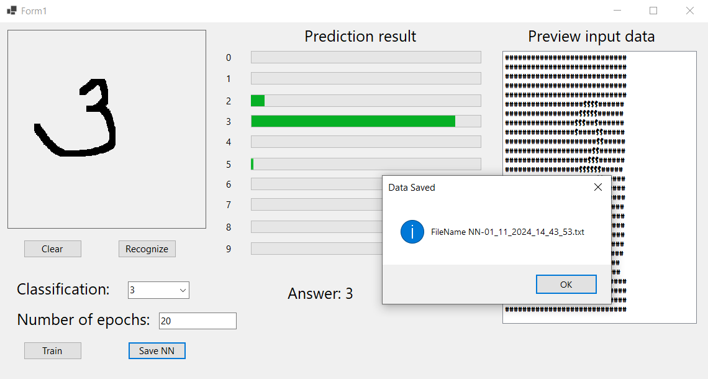

# Digit Recognition Project

## This is a winforms project that implements a perceptron for solving digit recognition task.

### What you can do:

#### 1. Drawing digits and checking the result
#### 2. Drawing a digit and training a neural network
#### 3. See a preview of the input data
#### 4. Saving the weights and biases

### Preview:
